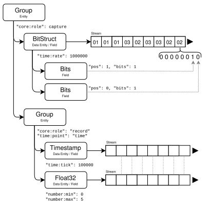

# Data Model

Iguazu aims to model time series data, with a focus on embedded systems and instrumentation. Use cases include:

  * Logic analyzer captures
  * Analog measurements and sensor readings
  * I-Q / complex samples and SDR recordings 
  * Decoded protocol events, messages, and packets

This document describes the semantics of the data model as well as the schema representation in JSON.

## Streams

Streams are the interface to the data storage layer. They are conceptually an append-only array of 8, 16, 32, or 64-bit elements, stored in fixed-size blocks. Further interpretation of the bits within an element is left to the field types; the stream just stores them.

In the Rust implementation, streams are a trait which is implemented by multiple storage backends that can load blocks on demand. Blocks are retained by a shared cache pool, and are also reference-counted so they cannot be evicted while in use.

For streams of live data or during import, a new block is added at the tail of the stream when the prior block fills. Readers may access the partial block at the tail of the stream while it is being written, and can subscribe to be notified when new elements arrive.

In the JSON representation in `.izs` and `.iguazu.json` files, streams are represented by a stream descriptor, a JSON object pointing to the stored data and other details like compression method needed to instantiate a stream backend when the file is opened.

## Entities and Fields

The schema is composed of a tree of entities and fields. Entities define the structure and relationship across multiple streams, while fields define how to interpret the bits of the elements within a single stream. Both have attached metadata [attributes](./attributes.md) that configure how to interpret and display the data.



In JSON, the `type` property specifies one of the entity or field types. Attributes are JSON properties with keys containing a colon (`:`), which they use as a namespace separator.

An entity with a `type` that is one of the field types below is a data entity. Data entities have a `data` property in JSON with a stream descriptor, and are simultaneously a leaf of the entity tree and a root of a field tree containing fields for interpreting the data in the stream.

## Field types

### Bits

Uninterpreted binary data.

```json
{
  "type": "bits",
  "pos": 2,
  "bits": 1
}
```

  - `pos`: bit offset of the field within the element (default 0)
  - `bits`: bit width

### Int and Signed

Integer or fixed-point number.

```json
{ "type": "int", "bits": 8 }
{ "type": "signed", "bits": 8 }
```

  - `pos`: bit offset within the element (default 0)
  - `bits`: bit width

### Float32 and Float64

Floating point number.

```json
{ "type": "float32" }
{ "type": "float64" }
```

### Character

Character assumed to be ASCII or a byte in a UTF-8 sequence.

```json
{ "type": "character" }
```

  - `pos`: bit offset of the field within the value (default 0)

### Timestamp

Monotonic timestamp.

```json
{ "type": "timestamp" }
```

### Enum

Enum or tagged union.

The `pos` and `bits` properties specify the location of the tag field. The tag field as an integer is used to index into the `values` array of strings for the enum variant names. The optional `variants` map is keyed by those values, containing fields that exist only if the tag matches the corresponding value.

```json
{
  "type": "enum",
  "bits": 2,
  "values": ["a", "b", "c"],
  "variants": {
    "a": {
      "type": "int",
      "pos": 2,
      "bits": 8
    }
  }
}
```

  - `pos`: bit offset of the tag field within the value (default 0)
  - `bits`: width of the tag field
  - `values`: names of the variants
  - `variants`: map of variant names to child fields

### BitStruct

Container for sub-fields.

Each child field specifies its own position and width. The order of the `children` map may influence display order but does not affect the bit layout. Fields are allowed to overlap if the same bits are to be interpreted in different ways.

```json
{
  "type": "bitstruct",
  "children": {
    "a": {
      "type": "bits",
      "bits": 1,
      "pos": 0
    },
    "b": {
      "type": "bits",
      "bits": 1,
      "pos": 1
    }
  }
}
```
  - `children`: A map of child fields

### Null

Field with no data; purely a place to attach attributes, such as an enum variant.

```json
{ "type": "null" }
```

## Entities

Other entity types are containers for multiple entities or delimit inner entities into arrays.

### Group

A container for named child entities.

  - `children` - map containing child entities

The semantics of a group vary depending on the `core:role` and other attributes attached. With `"core:role": "record"`, the child streams advance in lockstep, representing columnar fields of the same sequence of records or events. With `"core:role": "capture"`, the children represent the same period in time, but not necessarily sampled at the same rate or instants. Without a `role`, it is merely a hierarchical container without defining the relationship between the child entities.

### Tuple

Interleaved data such as audio channels, complex numbers, or event start-end spans. Element `i` in the inner stream corresponds to `names[i % names.len()]` of element `i / names.len()`.

  - `names` - names, in order, of the interleaved elements. 
  - `inner` - the inner entity

### FixedArray

Array data with a fixed repeating stride. Unlike a tuple, the elements are numbered instead of named. FixedArrays can be nested for multi-dimensional data such as images.

  - `elements` - stride or number of elements per array
  - `inner` - the inner entity

### VariableArray

Inner elements are delimited into variable-length lists, strings, or packets by an additional data stream containing the inner end index corresponding to each outer index.

  - `data` - a stream descriptor for the end indices
  - `inner` - the inner entity to which the delimiters apply

The `data` stream's elements are the end indices into the streams in `child`. That is, outer element 0 contains the child elements `0..data[0]` (end exclusive), outer element 1 is child elements `data[0]..data[1]` and so on.

String data is represented as a variable array with a `character` field inside.

## Summaries

To enable efficient zoomed-out viewing, Iguazu supports storing a pyramid of summary streams next to a data stream, each reduced in level of detail by a successive factor of two via a reduction function:

* `bit_and_or` - Bitwise minimum and maximum of the covered elements. Used for logic and trace views, including for sub-fields by masking the relevant bits. Interleaved min and max, size `floor(orig / 2^L) * 2`.
* `range` - Numerical minimum and maximum values of the covered elements. Used for plotting numerical data. Interleaved min and max, size `floor(orig / 2^L) * 2`.
* `skip` - First value of the covered elements. Used for a skiplist-like binary search on timestamp fields to map times to indexes, and on VariableArray delimiter streams to map inner index to outer index. Value `skip[L][i] = orig[i * 2^L]`. Size `floor(orig / 2^L)`. 

Level 0 represents the original data. Level 1 is a 2x reduction, level 2 is a 4x reduction and so on. Summaries have a `base_level` to skip the most detailed summary levels which can be obtained from the original data without much overhead, and would be the largest to store.

Summaries are represented in JSON in the `summaries` property on an entity:

```json
"summaries": {
  "bit_and_or": {
    "base_level": 3,
    "levels": [
      { /* data descriptor level 3, data reduced by a factor of 8 */ }
      /* ... */
      { /* data descriptor level N, data reduced by a factor of 2^N */ }
    ]
  }
}
```

## Related data models

### Apache Arrow

Iguazu's data model is inspired by [Apache Arrow], but has some significant differences due to the different objectives and relevant operations on the data they intend to store:

  * Data in Iguazu is usually time ordered, and wouldn't make sense to sort by any other key. Nor does it usually make sense to select or filter rows; if running a search you would want to see matches in context. 
  * Arrow supports aligned columns of tabular data only, while Iguazu groups are more flexible containers for streams at differing or non-uniform sample rates.
  * Arrow's unit of streaming data is the record batch. Record batches are variable length, but are received only once complete. For data that arrives sporadically, Arrow would require sending many small record batches to make them visible to the consumer immediately. Iguazu streams use fixed-size blocks to efficiently map between sample indices and block numbers for random access. Iguazu's underlying array primitive is [once-array], which allows incrementally sharing the buffer to consumers as it is filled, avoiding small batches or extra copies.
  * Each Arrow record batch contains a copy of the schema, while Iguazu turns this inside-out by having a single entity tree containing mutable metadata along with the reference-counted pointers to streams containing the data. This makes it easier for a consumer, such as a GUI, to modify attributes in the schema.
  * Arrow supports nullable columns throughout, while in Iguazu's domain, data is not usually nullable.
  * Iguazu is able to describe fields for interpreting data within a value at the bit level.

[Apache Arrow]: https://arrow.apache.org/docs/format/Intro.html
[once-array]: https://docs.rs/once-array/latest/once_array/

### SigMF

Iguazu's set of attributes are inspired by [SigMF] and its extensions. While a limited number of attributes are currently specified, the goal is to add more attributes such that SigMF metadata can be imported and exported losslessly.

The `.iguazu.json` "Virtual" format is a similar mechanic to SigMF in attaching metadata to adjacent flat files of samples. The `.izs` format goes further than SigMF `.tar.gz` datasets in offering a compressed container with random access.

SigMF tools that decode packets commonly write them as SigMF annotations. Iguazu supports multiple streams of typed data that should be more suitable for this purpose. Annotation attributes are not yet specified but would be intended for human-authored, mutable comments.

[SigMF]: https://sigmf.org/

### Vega-lite

[Vega-lite] and the Grammar of Graphics are an inspiration for annotating data with a mapping to visual attributes. While Iguazu currently only supports a zoomable timeline with time on the X axis, further visualizations and display options will be added.

[Vega-lite]: https://vega.github.io/vega-lite/
